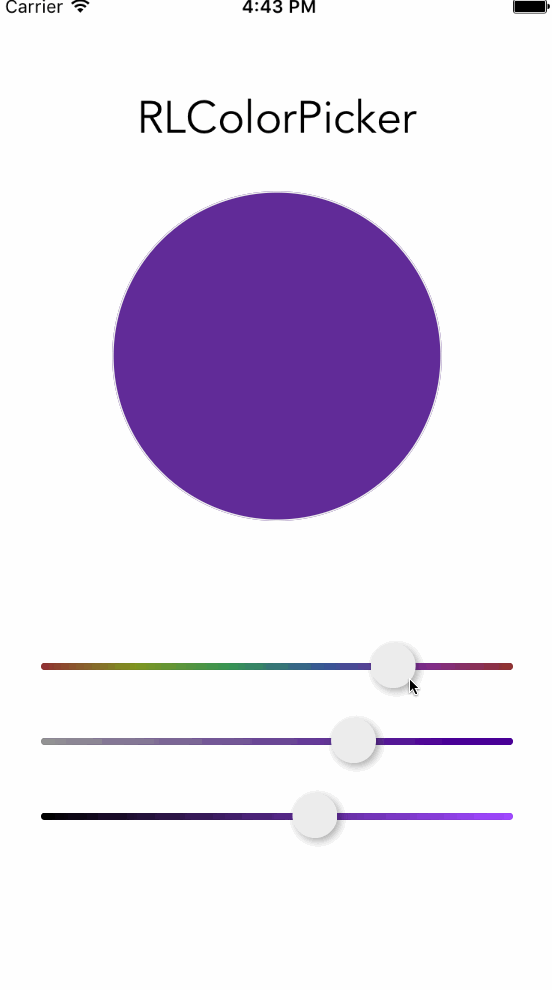

# RLHSBColorPicker
`RLHSBColorPicker` is a HSBA color picker like sip color app.

##Screenshot



##Installation
Add the `RLRoundView` `RLHSBSlider``RLColorPicker` `RLColorGradient` to your proj.


##Example usage

To add a color picker view:

```objective-c
#import "RLHSBSlider.h"
...

RLColorPicker * colorPicker  = [[RLColorPicker alloc]initWithColor:nil withFrame:CGRectMake(x, y,width,height)];
colorPicker.delegate = self;
[self.view addSubview:colorPicker];
```

To get color:

```objective-c 
<RLColorPickerDelegate>
...
 
-(void)getPickerColor:(UIColor *)color formPicker:(UIView *)picker
{
  [someView setBackgroundColor:color];
}

```

##Existing bug: 
>When add the alpha slider bar, if the hue or alpha value equle to 0, the other slider bar can not move.


##Contact
[nueneed@gmail.com](nueneed@gmail.com)

##License
MIT-License